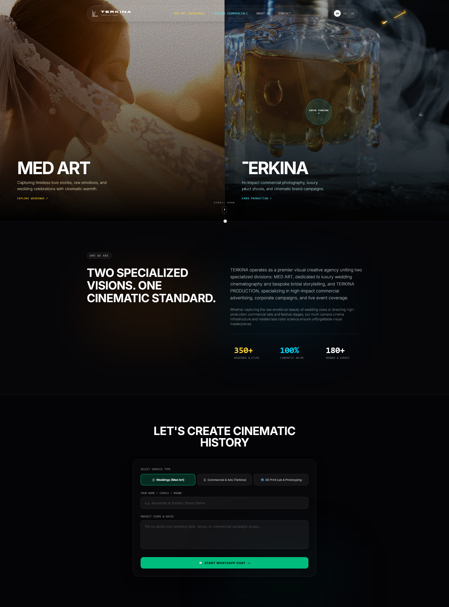

✦ TERKINA — Hybrid Visual Media & 3D Engineering Platform

    A luxury, full-stack creative agency platform & custom CRM built with Next.js App Router, React Three Fiber, Supabase, and Cloudinary.

📸 Hero Visual

     desktop capture of the Living Video Split Hero showing the MED ART (Amber/Gold) and TERKINA (Cyan/Cobalt) halves with the glowing cursor trail in action.

    🪐 360° Orbital Constellation Gallery: Compact 3D isometric rotating album carousel

    🧊 Real-Time WebGL 3D Marketplace: Interactive 3D product catalog with live .glb binary model streaming via React Three Fiber, contact shadows, dynamic cursor rim lighting, and finish/color switchers.

    💬 1-Click WhatsApp Lead & Order Dispatch: Friction-free, zero-cost WhatsApp Click-to-Chat integration that silently persists leads to the database prior to dispatch.

    🎛️ Master Obsidian CRM (/admin): Integrated admin control center featuring live database KPI metrics, drag-and-drop gallery reordering (@dnd-kit), per-item price visibility toggles (👁/👁‍🗨), and inventory stock switches (IN STOCK / OUT OF STOCK).

    ✍️ Live Site Content & Channels Editor: Update the primary WhatsApp dispatch number, agency email, and animated homepage counters (500+, 0.05mm, 100%) live from the CRM without redeploying code.

    🌐 Native Multi-Language & RTL Engine: State-driven i18n supporting English, French, and Arabic with layout direction flips (dir="rtl") and zero page-reload stutter.

    ⚡ On-Demand ISR Revalidation: Dedicated /api/revalidate route enabling instant cache purging whenever content is published or updated in the CRM.

    🛡️ Industrial Security Hardening: Strict Content Security Policy (CSP), anti-clickjacking (X-Frame-Options: DENY), IP-based edge rate limiting, Unicode-safe Zod schema validation, and Supabase Row Level Security (RLS) lockdown.

🛠 Tech Stack
Frontend & Visuals

    Framework: Next.js (App Router, React 19 / Server & Client Components)

    Styling: Tailwind CSS with custom typography & glassmorphism variables

    Animations: Framer Motion (Physics-based layout springs & kinetic typography)

    3D Graphics: React Three Fiber & @react-three/drei (Three.js WebGL rendering & .glb streaming)

    Canvas FX: Hardware-accelerated HTML5 Canvas 2D golden cursor light trail

Backend, Database & Media

    Database & Auth: Supabase (PostgreSQL with RLS, Auth, Triggers & B-Tree Indexes)

    Media & Asset CDN: Cloudinary (High-res photography, background video reels & raw .glb model streaming)

    State Management: Zustand / React Context (Language & layout direction state)

    CRM Utilities: @dnd-kit/core & @dnd-kit/sortable, react-easy-crop

    Validation: Zod

🚀 Getting Started

Follow these steps to run the complete ecosystem locally.

1. Prerequisites

Ensure you have the following installed on your machine:

    Node.js (v20.x or higher)

    npm or pnpm

    A free Supabase project

    A free Cloudinary account

2. Clone the Repository
   code Bash

git clone https://github.com/your-username/terkina.git
cd terkina

3. Install Dependencies
   code Bash

npm install

4. Configure Environment Variables

Create a .env.local file by copying the example configuration:
code Bash

cp .env.example .env.local

Fill in your actual API credentials in .env.local:
code Env

# Base URL Configuration

NEXT_PUBLIC_SITE_URL=http://localhost:3000

# Supabase Database & Auth Keys

NEXT_PUBLIC_SUPABASE_URL=https://your-project.supabase.co
NEXT_PUBLIC_SUPABASE_ANON_KEY=your-anon-public-key
SUPABASE_SERVICE_ROLE_KEY=your-service-role-secret-key

# Cloudinary Media Storage

NEXT_PUBLIC_CLOUDINARY_CLOUD_NAME=your_cloud_name
CLOUDINARY_API_KEY=your_cloudinary_api_key
CLOUDINARY_API_SECRET=your_cloudinary_api_secret

# On-Demand ISR Revalidation Secret

REVALIDATION_SECRET=your_custom_revalidation_secret_key

5. Database Setup (Supabase)

   Open your Supabase Dashboard

   →
   →

   SQL Editor.

   Run supabase/schema_v2.sql to initialize all tables, enums, triggers, and RLS policies.

   Run supabase/seed_real_data.sql to populate sample wedding albums, commercial shoots, and ready-made 3D .glb models.

   (Optional) Create your initial admin user in Supabase Authentication

   →
   →

   Users and assign the is_admin claim.

6. Run the Local Development Server
   code Bash

npm run dev

Open your browser and navigate to:

    Main Visual Studio: http://localhost:3000

    3D Lab & Marketplace: http://localhost:3000/3d

    Master CRM Dashboard: http://localhost:3000/admin

📂 Project Structure
code Text

terkina/
├── .github/
│ └── workflows/
│ └── ci.yml # GitHub Actions CI validation pipeline
├── public/
│ ├── videos/ # Ambient background video reels (.mp4 / .webm)
│ └── og-preview.jpg # Static social share preview banner
├── src/
│ ├── app/
│ │ ├── (public)/ # Public front-end portfolio routes
│ │ │ ├── page.tsx # Home: Living Video Split Hero & WhatsApp Contact
│ │ │ ├── weddings/ # Med Art Luxury Weddings Gallery
│ │ │ ├── production/ # Terkina Commercial & Events Gallery
│ │ │ └── 3d/ # 3D Engineering Lab & Physical Marketplace
│ │ ├── admin/ # Master CRM Control Center
│ │ │ ├── page.tsx # Real-time KPIs & Activity Overview
│ │ │ ├── weddings/ # Weddings Albums Manager (DND sorting)
│ │ │ ├── commercial/ # Commercial Campaigns Manager
│ │ │ ├── products/ # 3D Inventory Table (Price/Stock Toggles)
│ │ │ ├── inbox/ # Client Inquiries & Leads Center
│ │ │ └── content/ # Dynamic Site Content & WhatsApp Settings
│ │ ├── api/ # API Routes (/upload, /messages, /revalidate)
│ │ ├── layout.tsx # Global Root Layout & Schema.org JSON-LD
│ │ ├── sitemap.ts # Dynamic SEO Sitemap
│ │ └── robots.ts # Search Crawler Directives
│ ├── components/
│ │ ├── 3d-platform/ # 3D Viewer, MarketplaceGrid, CustomPrintSection
│ │ ├── admin/ # MediaUploader, StatusDropdown, PhotoProjectTable
│ │ ├── seo/ # Schema.org JSON-LD Injector
│ │ ├── Navbar.tsx # Kinetic liquid-glass navigation & mobile drawer
│ │ └── GoldenCursorTrail.tsx# 60fps HTML5 Canvas golden stardust trail
│ ├── context/ # Language & i18n state provider
│ └── lib/ # Supabase clients, Zod validations, CRM helpers
├── supabase/ # Production SQL migrations & seed scripts
├── Dockerfile # Production multi-stage standalone Dockerfile
└── next.config.ts # Security headers, CSP & standalone output

🤝 Contributing

Contributions are welcome! If you'd like to improve the codebase, add new WebGL shaders, or refine CRM workflows:

    Fork the repository.

    Create a feature branch:
    code Bash

    git checkout -b feat/my-new-feature

    Commit your changes:
    code Bash

    git commit -m "feat: add interactive shader effect"

    Push to the branch:
    code Bash

    git push origin feat/my-new-feature

    Open a Pull Request with a detailed description of your changes.

📄 License

Distributed under the MIT License. See LICENSE for more details.

Crafted with precision for <strong>TERKINA & MED ART STUDIOS</strong>.

